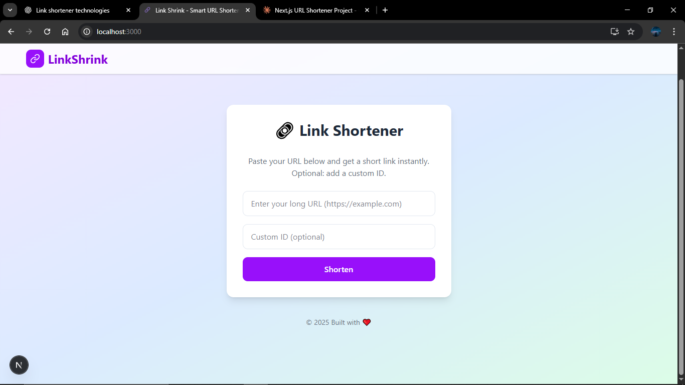
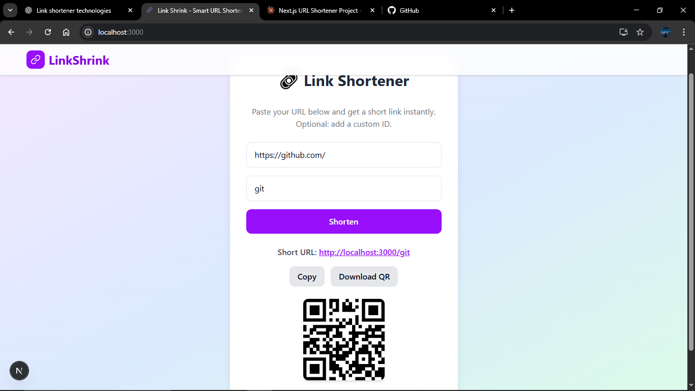

# 🔗 LinkShrink

<div align="center">
  
  
  **🚀 [Live Demo](https://link-shrink-eta.vercel.app/) 🚀**
</div>

A simple URL shortener that converts long URLs into short links and generates QR codes.

## ✨ Features

- ✂️ **URL Shortening** - Turn long URLs into short, shareable links
- 📱 **QR Code Generation** - Get QR codes for easy mobile sharing
- 🛡️ **URL Validation** - Automatic validation for proper URLs
- 🎨 **Clean UI** - Modern design with Tailwind CSS

## 🚀 Quick Start

1. **Clone & Install**
   ```bash
   git clone https://github.com/piyush15975/link-shrink.git
   cd link-shrink
   npm install
   ```

2. **Environment Setup**
   ```bash
   # Create .env.local
   MONGO_URI=your-mongodb-connection-string
   NEXT_PUBLIC_BASE_URL=http://localhost:3000
   ```

3. **Run Development Server**
   ```bash
   npm run dev
   ```

4. **Open** [http://localhost:3000](http://localhost:3000)

## 📸 Screenshots

### Main Interface


### QR Code Generation
<div align="center">
  
  <br>
  <em>Example of generated QR code for shortened URL</em>
</div>

## 🛠️ Tech Stack

- **Next.js 15** - React framework
- **MongoDB** - Database
- **Tailwind CSS** - Styling
- **QRCode.react** - QR code generation
- **TypeScript** - Type safety

## 🌟 How It Works

1. Enter a long URL
2. Get a shortened URL + QR code
3. Share anywhere!

---

**Built with ❤️ using Next.js and MongoDB**
